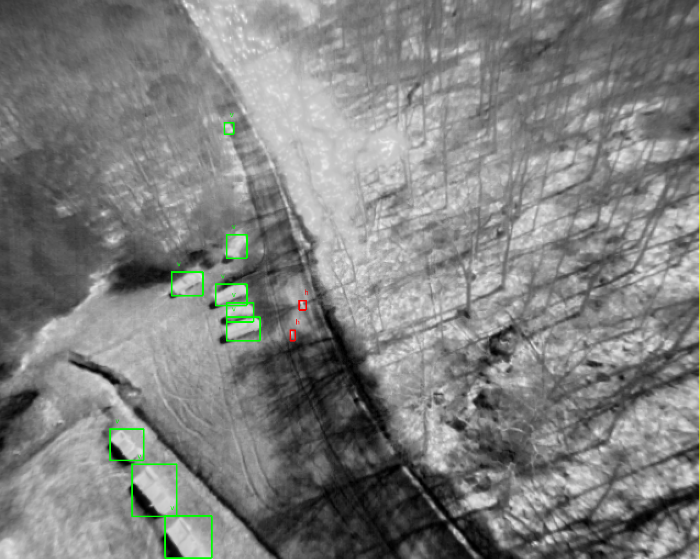

# WIT UAS Dataset

## About



- This dataset contains bounding box annotated Wildland-fire Infrared Thermal (WIT) images for crew assets detection with Unmanned Aerial Systems (UAS), it is captured during prescribed burns

- [Available Labels](./dataset.classes)

## Test Object Detection

Clone the repo locally:

```Shell
git clone --recursive https://github.com/castacks/WIT-UAS-Dataset.git
```

### Environment Setup

There are 2 options:

- Docker (recommended):

  1. Install [**Docker**](https://docs.docker.com/get-docker/) and [**nvidia-docker2**](https://docs.nvidia.com/datacenter/cloud-native/container-toolkit/install-guide.html#docker)

  1. Run the pre-built docker image (automatically pulls when missing):

     ```Shell
     ./scripts/run.sh
     ```

  1. Attach to the running container:

     ```Shell
     docker attach wit-uas-dataset
     ```

- Conda/Mamba environment manager:

  1. Install [**Anaconda**](https://docs.anaconda.com/anaconda/install/index.html) or [**Mamba**](https://mamba.readthedocs.io/en/latest/installation.html)

  1. Create environment for **WIT**:

     ```Shell
     conda env create -f environment.yml
     ```

  1. Activate **WIT**:

     ```Shell
     conda activate WIT
     ```

### Visualization

- Visualization using wandb is optional, but when needed:

  1. Register an account on [wandb.ai](https://wandb.ai/site)

  1. Login to your wandb account locally:

     ```Shell
     wandb login
     ```

Send an email to [Mukai (Tom Notch) Yu](mailto:mukaiy@andrew.cmu.edu) if you are not invited to team *cmu-ri-wildfire*.

### Run training on WIT dataset

To train the models: `./model/yolo/train.py` or `./model/ssd/train.py`

You may need to adjust the batch size according to your GPU memory by using the `--batch-size` argument

## How To Contribute

1. Clone the repo locally

   ```Shell
   git clone --recursive https://github.com/castacks/WIT-UAS-Dataset.git
   ```

1. Create a new branch for your work:

   ```Shell
   git checkout -b <branch-name>
   ```

1. Setup required development environment

   ```Shell
   ./scripts/setup.sh
   ```
